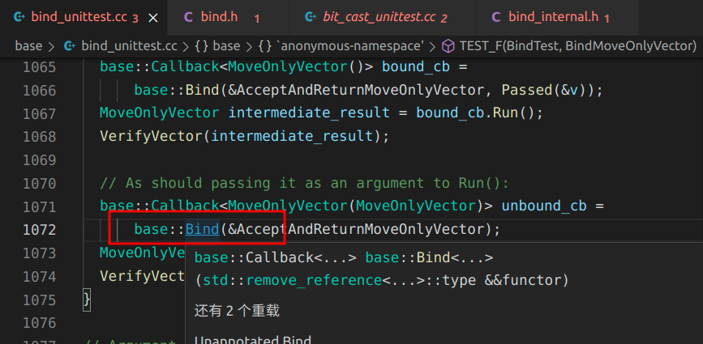
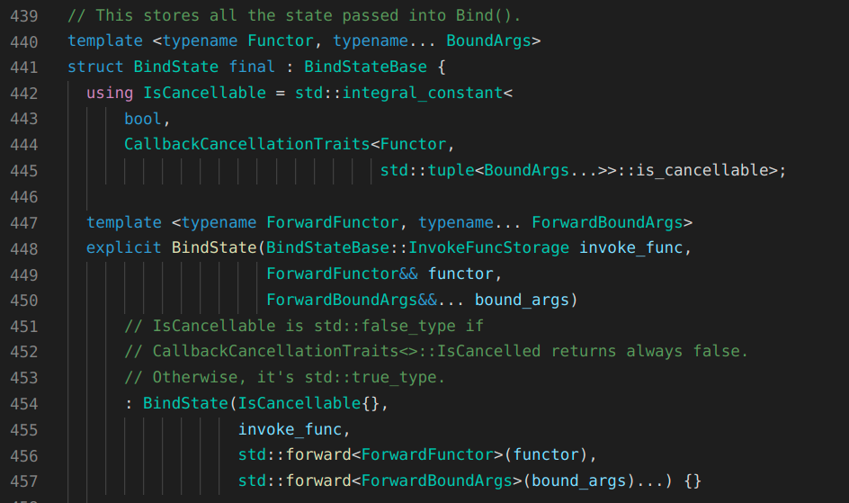
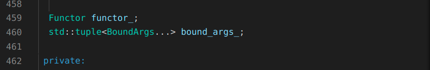
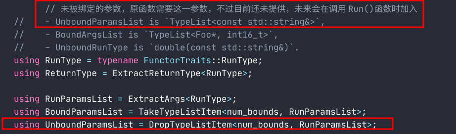

# Chromium bind和callback库泛化仿函数解析

## 知识准备

- 模板编程

## 问题引入

最近读到了《Modern C++ Design》泛化仿函数章节，感觉特别有意思。这部分也是最开始接触Chromium时让我十分吃惊的用法。

不过我那本《Modern C++ Design》泛化仿函数实现并没有用到C++11的新特性**可变参数模板**，因此就去翻了翻Chromium关于这部分的代码，基本上在base文件夹下的bind库和callback库中。

下面就基于这些文件的代码解析下泛化仿函数。

先看看使用样例

```C++
/*
  样例1
  无参函数
*/
int MyFunc() { return 0; }
base::Callback<int(void)> func_cb = base::Bind(&MyFunc);
func_cb.Run();

/*
  样例2
  有参函数
*/
void MyFunc(int i, const std::string& str) {}
base::Callback<void(int, const std::string&)> func2_cb = base::Bind(&MyFunc, 23, "hello world");
func2_cb.Run();

/*
  样例1
  有参函数
  在调用Run()时传参
*/
int MyFunc(int i, const std::string& str) {}
base::Callback<int(int, const std::string&)> func3_cb = base::Bind(&MyFunc);
func3_cb.Run(23, "hello world");
/*
// 甚至还能这么写
base::Callback<void(int, const std::string&)> func3_cb = base::Bind(&MyFunc, 23);
func3_cb.Run("hello world");
*/
```


看到样例的第一眼，是不是感觉很神奇。（我第一次也是这样，外加震惊）

再接着看看这些样例，从中我们可以抽离出几种信息：

- base::Bind可以绑定一个函数，并根据此函数的参数可以继续为base:Bind添加参数
- 参数不一定要在base::Bind全部给补充完整，在调用Run()函数时仍然能补充参数

根据上述那些比较直观的信息，可以得到下面这些问题：

- base::Bind函数这儿并没有传函数的返回值和参数进去，那base::Bind是如何得到它们的呢？
- 对于样例3：base::Bind函数参数与调用Run()函数时的参数是如何凑成目标函数的参数的呢？

接着，我们通过源码来分析上述问题。

## 代码分析

在单元测试文件(bind_unittest.cc)随便找个相关代码跳转到base::Bind源码位置。



### Bind

顺利跳转到源码位置：

```C++
// bind.h
// Line 239
template <typename Functor, typename... Args>
inline Callback<MakeUnboundRunType<Functor, Args...>>
Bind(Functor&& functor, Args&&... args) {
  return base::BindRepeating(std::forward<Functor>(functor),
                             std::forward<Args>(args)...);
}
```


这里使用到模板编程，（基本所有地方都是模板编程，得有知识准备，之后不再强调），实际调用Bind时，并没有明写Functor和Args，是因为这儿利用了隐式实例化，编译器会通过传递的参数反向推导Functor和Args。

这儿只做了一件事，调用BindRepeating函数，并将参数传递过去。

我们继续跳转到BindRepeating源码位置。

```C++
// bind.h
// Line 195
// Bind as RepeatingCallback.
template <typename Functor, typename... Args>
inline RepeatingCallback<MakeUnboundRunType<Functor, Args...>>
BindRepeating(Functor&& functor, Args&&... args) {
  static_assert(
      !internal::IsOnceCallback<std::decay_t<Functor>>(),
      "BindRepeating cannot bind OnceCallback. Use BindOnce with std::move().");

  // 这儿的helper帮助进行函数特征(返回值、参数等)的推导
  using Helper = internal::BindTypeHelper<Functor, Args...>;
  using FunctorTraits = typename Helper::FunctorTraits;
  using BoundArgsList = typename Helper::BoundArgsList;
  using UnwrappedArgsList =
      internal::MakeUnwrappedTypeList<false, FunctorTraits::is_method,
                                      Args&&...>;
  using BoundParamsList = typename Helper::BoundParamsList;
  static_assert(internal::AssertBindArgsValidity<
                    std::make_index_sequence<Helper::num_bounds>, BoundArgsList,
                    UnwrappedArgsList, BoundParamsList>::ok,
                "The bound args need to be convertible to the target params.");

  using BindState = internal::MakeBindStateType<Functor, Args...>;
  using UnboundRunType = MakeUnboundRunType<Functor, Args...>;
  using Invoker = internal::Invoker<BindState, UnboundRunType>;
  using CallbackType = RepeatingCallback<UnboundRunType>;

  // Store the invoke func into PolymorphicInvoke before casting it to
  // InvokeFuncStorage, so that we can ensure its type matches to
  // PolymorphicInvoke, to which CallbackType will cast back.
  using PolymorphicInvoke = typename CallbackType::PolymorphicInvoke;
  PolymorphicInvoke invoke_func = &Invoker::Run;

  using InvokeFuncStorage = internal::BindStateBase::InvokeFuncStorage;
  return CallbackType(new BindState(
      reinterpret_cast<InvokeFuncStorage>(invoke_func),
      std::forward<Functor>(functor),
      std::forward<Args>(args)...));
}

```


上述代码看的人眼花缭乱、摸不着头脑，别急，我们一个一个分析。

### Helper

首先是Helper

```C++
using Helper = internal::BindTypeHelper<Functor, Args...>;
```


Helper在注释里提到一句，说是对函数的特征进行推导。

我们去看看到底是怎么推导的。

```C++
// bind_internal.h
// Line 375
// Extracts necessary type info from Functor and BoundArgs.
// Used to implement MakeUnboundRunType, BindOnce and BindRepeating.
template <typename Functor, typename... BoundArgs>
struct BindTypeHelper {
  // 获取参数的长度
  static constexpr size_t num_bounds = sizeof...(BoundArgs);
  // 函数特征信息
  using FunctorTraits = MakeFunctorTraits<Functor>;

  // Example:
  //   When Functor is `double (Foo::*)(int, const std::string&)`, and BoundArgs
  //   is a template pack of `Foo*` and `int16_t`:
  //    - RunType is `double(Foo*, int, const std::string&)`,
  //    - ReturnType is `double`,
  //    - RunParamsList is `TypeList<Foo*, int, const std::string&>`,
        // 已绑定的参数，即通过Bind()提供的参数
  //    - BoundParamsList is `TypeList<Foo*, int>`,
        // 未被绑定的参数，原函数需要这一参数，不过目前还未提供，未来会在调用Run()函数时加入
  //    - UnboundParamsList is `TypeList<const std::string&>`,
  //    - BoundArgsList is `TypeList<Foo*, int16_t>`,
  //    - UnboundRunType is `double(const std::string&)`.
  using RunType = typename FunctorTraits::RunType;
  using ReturnType = ExtractReturnType<RunType>;

  using RunParamsList = ExtractArgs<RunType>;
  using BoundParamsList = TakeTypeListItem<num_bounds, RunParamsList>;
  using UnboundParamsList = DropTypeListItem<num_bounds, RunParamsList>;

  using BoundArgsList = TypeList<BoundArgs...>;

  using UnboundRunType = MakeFunctionType<ReturnType, UnboundParamsList>;
};

```


这部分内容的作用其实原本的英文注释说得非常清楚。这里再列出来。

重点是**BoundParamsList**和**UnboundParamsList**，**ReturnType**也同样重要。

到这里算是简单地解释了一个问题1，

[base::Bind函数这儿并没有传函数的返回值和参数进去，那base::Bind是如何得到它们的呢？](https://www.wolai.com/kT41JRabxWDx8GCL4LqjVB)

```C++
  // Example:
  //   When Functor is `double (Foo::*)(int, const std::string&)`, and BoundArgs
  //   is a template pack of `Foo*` and `int16_t`:
  //    - RunType is `double(Foo*, int, const std::string&)`,
  //    - ReturnType is `double`,
  //    - RunParamsList is `TypeList<Foo*, int, const std::string&>`,
        // **已绑定的参数，即通过Bind()提供的参数**
  //    - BoundParamsList is `TypeList<Foo*, int>`,
        // **未被绑定的参数，原函数需要这一参数，不过目前还未提供，未来会在调用Run()函数时加入**
  //    - UnboundParamsList is `TypeList<const std::string&>`,
  //    - BoundArgsList is `TypeList<Foo*, int16_t>`,
  //    - UnboundRunType is `double(const std::string&)`.
```


函数特征到底是怎么推导的，这儿先不说，目前清楚功能就可以了。

### FunctorTraits和BoundArgsList

之后是BindRepeating"第二、三行"代码：

```C++
using FunctorTraits = typename Helper::FunctorTraits;
using BoundArgsList = typename Helper::BoundArgsList;

```


这里直接调用了Helper内部的信息，看上面的内容就明白了。

### BindState

继续下一行代码

```C++
using BindState = internal::MakeBindStateType<Functor, Args...>;
```


这里将会得到一个BindState类型，内部会对几种类型的函数区分（比如是不是一个方法）。

BindState是一个类，继承自BindStateBase，它保存了从Bind()函数获取到的所有状态。



比如函数类型以及参数被各自保存起来，其中参数以元组形式保存。



继续下一行代码

### UnboundRunType

```C++
using UnboundRunType = MakeUnboundRunType<Functor, Args...>;
```




前文已提到过。

继续下一行代码

### Invoker

```C++
using Invoker = internal::Invoker<BindState, UnboundRunType>;
```


此行代码是**核心**，在后续Callback.Run()函数执行时，会调用下面代码中的Run()静态函数

```C++
// bind_internal.h
// Line 326
// 这儿的UnboundArgs为未绑定参数，即通过Run()传递进来的
// 它将与BoundArgs参数一起组成 函数 需要的参数
template <typename StorageType, typename R, typename... UnboundArgs>
struct Invoker<StorageType, R(UnboundArgs...)> {
  static R RunOnce(BindStateBase* base,
                   PassingTraitsType<UnboundArgs>... unbound_args) {
    ...
  }
  // Callback.Run() 最终会调用下面这个函数
  static R Run(BindStateBase* base,
               PassingTraitsType<UnboundArgs>... unbound_args) {
    // 之前也提到过，BindStateBase保存了Bind()接受到的所有状态，Functor以及Args在里面
    // 下面也通过storage->functor_和storage->bound_args_分别对它们进行访问
    const StorageType* storage = static_cast<StorageType*>(base);
    // storage->bound_args_是一个元组
    // 已绑定参数的长度
    static constexpr size_t num_bound_args =
        std::tuple_size<decltype(storage->bound_args_)>::value;
    // 调用实现函数
    return RunImpl(storage->functor_, storage->bound_args_,
                   std::make_index_sequence<num_bound_args>(),
                   std::forward<UnboundArgs>(unbound_args)...);
  }

 private:
  template <typename Functor, typename BoundArgsTuple, size_t... indices>
  static inline R RunImpl(Functor&& functor,
                          BoundArgsTuple&& bound,
                          std::index_sequence<indices...>,
                          UnboundArgs&&... unbound_args) {
    static constexpr bool is_method = MakeFunctorTraits<Functor>::is_method;

    using DecayedArgsTuple = std::decay_t<BoundArgsTuple>;
    static constexpr bool is_weak_call =
        IsWeakMethod<is_method,
                     std::tuple_element_t<indices, DecayedArgsTuple>...>();
    // 将调用转发给InvokeHelper::MakeItSo()
    // 这是因为需要将BoundArgs和UnboundArgs合并
    // 形成函数调用需要的参数
    return InvokeHelper<is_weak_call, R>::MakeItSo(
        std::forward<Functor>(functor),
        Unwrap(std::get<indices>(std::forward<BoundArgsTuple>(bound)))...,
        std::forward<UnboundArgs>(unbound_args)...);
  }
};
```


```C++
// bind_internal.h
// Line 289
template <typename ReturnType>
struct InvokeHelper<false, ReturnType> {
  template <typename Functor, typename... RunArgs>
  // 两种参数合并到一起
  // 不过函数似乎还是没有执行
  static inline ReturnType MakeItSo(Functor&& functor, RunArgs&&... args) {
    using Traits = MakeFunctorTraits<Functor>;
    return Traits::Invoke(std::forward<Functor>(functor),
                          std::forward<RunArgs>(args)...);
  }
};
```


这里可以解释问题二，

[对于样例3：base::Bind函数参数与调用Run()函数时的参数是如何凑成目标函数的参数的呢？](https://www.wolai.com/5S84x99qEDL2jjR4YuSwkB)

参数有一个合并过程，不过合并过程并不是手动合并，而是交给编译器(可变参数)合并。

这里函数还是没有执行，因为我们函数类型其实存在很多种情况，C函数指针，方法函数，匿名函数等等，所以需要通过MakeFunctorTraits区分。

咱们用的是普通函数，因此直接看Chromium为普通函数准备的礼物。

```C++
// bind_internal.h
// Line 157
// For functions.
template <typename R, typename... Args>
struct FunctorTraits<R (*)(Args...)> {
  using RunType = R(Args...);
  static constexpr bool is_method = false;
  static constexpr bool is_nullable = true;

  template <typename... RunArgs>
  static R Invoke(R (*function)(Args...), RunArgs&&... args) {
    // 它终于被执行了！
    return function(std::forward<RunArgs>(args)...);
  }
};
```


好像有些跑题，不过它确实已经执行完毕了。

### CallbackType

继续下一行代码

```C++
using CallbackType = RepeatingCallback<UnboundRunType>;
```


这行代码指明了回调类型，本质是一个RepeatingCallback类 ，之后它将被当做返回值返回给用户。

继续下面的代码

```C++
  // Store the invoke func into PolymorphicInvoke before casting it to
  // InvokeFuncStorage, so that we can ensure its type matches to
  // PolymorphicInvoke, to which CallbackType will cast back.
  using PolymorphicInvoke = typename CallbackType::PolymorphicInvoke;
  PolymorphicInvoke invoke_func = &Invoker::Run;

  using InvokeFuncStorage = internal::BindStateBase::InvokeFuncStorage;
```


这些代码是为了满足多态性，将函数转化为void(*)()类型。在之后调用时会被转化回原来的类型。

最后一行代码

### 返回Callback实例

```C++
return CallbackType(new BindState(
      reinterpret_cast<InvokeFuncStorage>(invoke_func),
      std::forward<Functor>(functor),
      std::forward<Args>(args)...));
```


实例化一个Callback类，以BindState作为参数，所以说BindState是中间量，在Callback调用时，BindState保存的状态(Functor和Args)将会发挥作用。


## Callback.Run()

到这里Bind函数的使命就完成了，下面轮到Callback类，调用Run()方法执行函数。

```C++
// callback.h
// Line 69
template <typename R, typename... Args>
class RepeatingCallback<R(Args...)> : public internal::CallbackBaseCopyable {
 public:
  using RunType = R(Args...);
  using PolymorphicInvoke = R (*)(internal::BindStateBase*,
                                  internal::PassingTraitsType<Args>...);

  RepeatingCallback() : internal::CallbackBaseCopyable(nullptr) {}

  explicit RepeatingCallback(internal::BindStateBase* bind_state)
      : internal::CallbackBaseCopyable(bind_state) {}

  ...

  R Run(Args... args) const & {
    PolymorphicInvoke f =
        reinterpret_cast<PolymorphicInvoke>(this->polymorphic_invoke());
    // 执行的是 BindRepeating 函数中的invoke_func函数
    // 见bind.h L227
    // 其实就是Invoker::Run函数
    return f(this->bind_state_.get(), std::forward<Args>(args)...);
  }

  ...
};
```


详细运行过程可以返回去看Invoker部分。

## 尾声

Chromium泛化仿函数分析到这里就接近尾声了，不过还有一个问题留了下来，就是函数特征信息是如何推导出来的呢？

```C++
template <typename Functor>
struct FunctorTraits;

template <typename R, typename... Args>
struct FunctorTraits<R (*)(Args...)> {
    using ReturnType = R;
};

template <typename Functor>
using MakeFunctorTraits = FunctorTraits<std::decay_t<Functor>>;
```


仔细观察这几行代码，本来MakeFunctorTraits还是Functor，为FunctorTraits提供了一个std::decay_t<Functor>就将普通函数类型给转换成了<typename R, typename... Args>，R就是返回值类型，Args是可变参数类型。

所以一切都是std::decay_t的功劳啦。

至于为什么能这样做，去看看它的源码就知道啦。


最后，为了更清楚地了解泛化仿函数的实现，我自己写了100行比较简单的代码，并没有像chromium这样复杂的设计，不过仅仅是试验品，仅支持普通函数，不支持匿名函数以及方法，github仓库见，

[https://github.com/hc-tec/functor](https://github.com/hc-tec/functor)

欢迎star。

