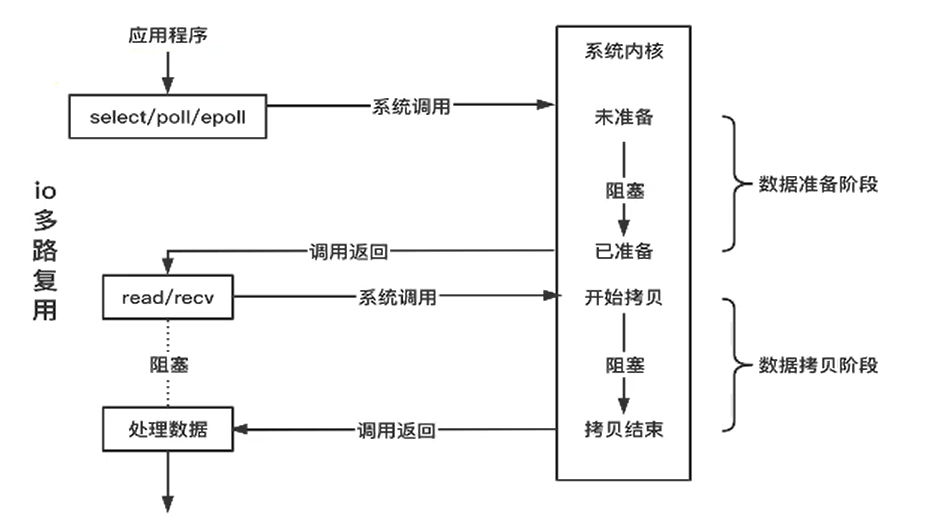
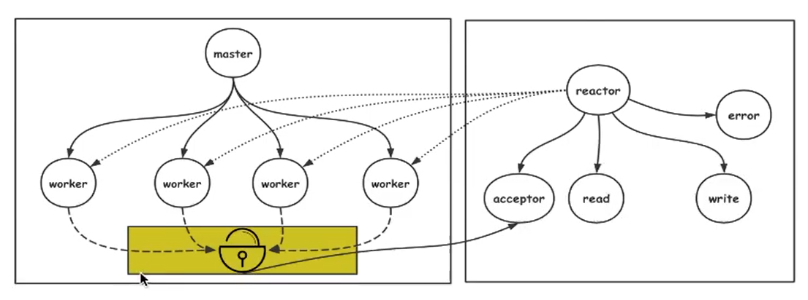

# epoll 原理与Reactor模型

### 阻塞IO

不需要主动探测，但是会阻塞线程

### 非阻塞 IO

需要主动探测数据是否准备

### IO多路复用

用一个线程来检测多个不同连接的 IO 事件

> linux : select poll epoll
window : IOCP
mac : kqueue

### epoll 原理图

要点

> 所有添加到 epoll 中的事件都会与网卡驱动程序建立回调关系，相应的事件发生时会调用这里的回调方法（ep_poll_callback），它会把这样的事件放在 rdllist 双向链表中。

### Reactor 模型

组成：**非阻塞 IO + IO 多路复用** 

特征：基于**事件循环** ，以**事件驱动** 或者**事件回调** 方式实现业务逻辑

理解：将IO的处理转换为事件的处理

### 单 Reactor 模型

代表：Redis

### 单 Reactor 模型 + 任务队列 + 线程池

代表：skynet

### 多 Reactor

代表：memcached

libevent 是对 reactor 的封装，可以用 libevent 实现多 reactor

### Reactor 模型 + 多进程 

代表：nginx

### 多 Reactor +消息队列+线程池

业务场景中比较多  网络密集型+业务密集型

并发高，但处理时间会加长

