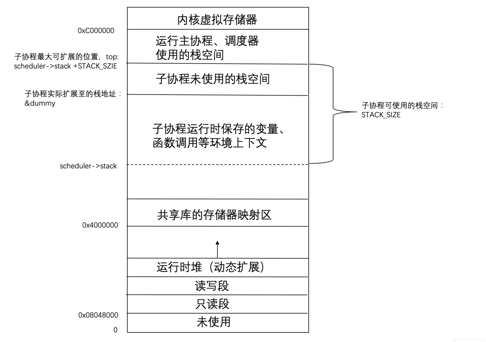

# 云凤协程库 coroutine 源码解析

云凤大大协程库 **coroutine**   github地址

[http://github.com/cloudwu/coroutine](http://github.com/cloudwu/coroutine)

### 协程简介

协程是用同步的写法达到异步的性能。其基本原理是在IO等待时切换出去，在适当的时刻切换回来，最大程度利用CPU。协程可以理解为一个用户级的线程，一个线程里跑多个协程。并且，不管协程数量多少，都是串行运行的，就是说不存在同一时刻属于一个线程的不同协程同时运行。因此避免了多线程编程可能导致的**同步问题** 。

协程的行为有点像函数调用，但也有不同，对于函数调用来说，假如函数A调用函数B，则必须等待函数B执行完毕后才能重新返回A，但对于协程来说，如果再协程A中切换到协程B，协程B可以选择在某个点重新回到A的执行流，同时允许在某个时刻重新从A回到B之前运行到的那个点。这在函数中是不可能实现的，因为函数只能一路走到底。

#### 优缺点

优点：

1. 协程切换的时候开销小，用户态且轻量

2. 非抢占式，不用加很多锁，减小复杂度，不用很复杂的处理线程同步问题。  

缺点：  

&ensp;&ensp;&ensp;&ensp;协程不能利用多核，只能使用单核，因为同时只有一个协程在运行。

#### 适用场景

1. IO密集型。  

2. 在IO密集的情况下，协程的开销比线程小，能快速实现调度。  

3. 协程不适用于计算密集型，协程不能很好的利用多核cpu。

### 设计思路分析

coroutine 采用的是 linux 提供的 ucontext 函数簇，主要提供四个函数供协程实现与切换，非常简单易用。

```c
//获取当前的上下文保存到ucp
getcontext(ucontext_t *ucp)
//直接到ucp所指向的上下文中去执行
setcontext(const ucontext_t *ucp)
//创建一个新的上下文
makecontext(ucontext_t *ucp, void (*func)(), int argc, ...) 
//将当前上下文保存到oucp,然后跳转到ucp上下文执行
int swapcontext(ucontext_t *oucp, const ucontext_t *ucp)

//ucontext结构体
typedef struct ucontext {
  //当这个上下文终止后，运行uc_link指向的上下文
  //如果为NULL则终止当前线程
    struct ucontext* uc_link;
    //  为该上下文的阻塞信号集合
    sigset_t uc_sigmask;
    //该上下文使用的栈
    stack_t uc_stack;
    //保持上下文的特定寄存器
    mcontext_t uc_mcontext;
    ...
} ucontext_t

```


ucontext 简易使用示例

```c
#include <stdio.h>
#include <ucontext.h>
#include <unistd.h>


void fun1()
{
    printf("func1\n");
}
void fun2(ucontext_t *ctx)
{
    ucontext_t t_ctx;
    printf("func2\n");
    swapcontext(&t_ctx, ctx);
}

int main(int argc, char *argv[]) {
    ucontext_t context, context2, main_ctx;
    char stack[1024];                                                                                                                         
    getcontext(&context);
    getcontext(&context2);
    context.uc_stack.ss_sp = stack;
    context.uc_stack.ss_size = 1024;
    context.uc_link = &main_ctx;
    context2.uc_stack.ss_sp = stack;
    context2.uc_stack.ss_size = 1024;
    makecontext(&context,(void (*)(void))fun1, 0);
    swapcontext(&main_ctx, &context);
    puts("main");
    makecontext(&context2,(void (*)(void))fun2,1,&main_ctx);
    swapcontext(&main_ctx, &context2);
    puts("main over");
    return 0;
}

```


执行结果

```c
func1
main
func2
main over

```


coroutine 提供简洁的 API 的设计，易于使用。

```c
//协程对象的四种状态
#define COROUTINE_DEAD 0
#define COROUTINE_READY 1
#define COROUTINE_RUNNING 2
#define COROUTINE_SUSPEND 3

//新建协程调度器对象
struct schedule * coroutine_open(void);
//关闭协程调度器
void coroutine_close(struct schedule *);

//创建协程对象
int coroutine_new(struct schedule *, coroutine_func, void *ud);
//执行协程对象（启动或继续）
void coroutine_resume(struct schedule *, int id);
//返回协程对象的状态
int coroutine_status(struct schedule *, int id);
//返回正在执行的协程ID
int coroutine_running(struct schedule *);
//yeild当前执行的协程，返回到主协程
void coroutine_yield(struct schedule *);

```


coroutine 采用共享栈方式供协程栈使用，共享栈大小为 **1M** ，协程运行时，通过 ucontext 将所需栈指向共享栈，运行时所需数据的空间直接在共享栈中分配，这样不必为每个协程单独分配栈空间，因此解决因协程过多可能导致的爆栈问题。但在协程切换时，需要将上一个协程使用的栈空间保存到协程私有空间中，每次协程切换都会涉及到内存空间 copy 过程。

### 源码解析

coroutine 中包含两个结构体，调度器和协程。

```c
//协程调度器
struct schedule {
  char stack[STACK_SIZE];  // 默认大小1MB，是一个共享栈，所有协程运行时都在其上
  ucontext_t main;    // 主协程上下文
  int nco;        // 协程调度器中存活协程个数
  int cap;        // 协程调度器管理最大容量。最大支持多少协程。当nco >= cap时候要扩容
  int running;      // 正在运行的协程ID(索引)
  struct coroutine **co;  // 一维数组，数组元素是协程指针
};

//协程
struct coroutine {
  coroutine_func func;  // 协程执行函数
  void *ud;        // 协程执行函数的参数
  ucontext_t ctx;      // 协程上下文
  struct schedule * sch;  // 协程对应的调度器
  ptrdiff_t cap;      // 协程自己保存栈的最大容量（stack的容量）
  ptrdiff_t size;      // 协程自己保存的栈当前大小（stack的大小）
  int status;        // 协程状态
  char *stack;      // 当前协程自己保存的栈数据，因为是共享栈的设计，
                    // 即每个协程都在同一个栈空间中切换，所以每个协程在切换出来后要保存自己的栈内容
};

```


协程初始化函数 _co_new

```c
struct coroutine * 
_co_new(struct schedule *S , coroutine_func func, void *ud) {
  struct coroutine * co = malloc(sizeof(*co));
  co->func = func;
  co->ud = ud;
  co->sch = S;
  co->cap = 0;
  co->size = 0;
  co->status = COROUTINE_READY; // 协程初始化状态
  co->stack = NULL;
  return co;
}
```


调度器初始化函数 coroutine_open

```c
struct schedule * 
coroutine_open(void) {
  struct schedule *S = malloc(sizeof(*S));
  S->nco = 0;
  S->cap = DEFAULT_COROUTINE; // 默认协程容量为 16
  S->running = -1; 
  S->co = malloc(sizeof(struct coroutine *) * S->cap);
  memset(S->co, 0, sizeof(struct coroutine *) * S->cap);
  return S;
}
```


将协程与函数绑定 coroutine_new，返回协程 id (索引)

```c
int 
coroutine_new(struct schedule *S, coroutine_func func, void *ud) {
  struct coroutine *co = _co_new(S, func , ud); // 创建一个协程
  // 判断协程数量是否超过容量
  if (S->nco >= S->cap) {
    // 超过容量，需要扩容
    int id = S->cap;
    S->co = realloc(S->co, S->cap * 2 * sizeof(struct coroutine *));
    memset(S->co + S->cap , 0 , sizeof(struct coroutine *) * S->cap);
    S->co[S->cap] = co;
    S->cap *= 2;
    ++S->nco;
    return id;
  } else {
    // 没超过容量，则从已有的空间中找出空闲的空间
    int i;
    for (i=0;i<S->cap;i++) {
      int id = (i+S->nco) % S->cap;
      if (S->co[id] == NULL) {
        S->co[id] = co;
        ++S->nco;
        return id;
      }
    }
  }
  assert(0);
  return -1;
}
```


运行协程 mainfunc

```c
static void
mainfunc(uint32_t low32, uint32_t hi32) {
  uintptr_t ptr = (uintptr_t)low32 | ((uintptr_t)hi32 << 32);
  struct schedule *S = (struct schedule *)ptr;
  int id = S->running; // 获取当前协程 id
  struct coroutine *C = S->co[id]; // 根据 id 获取协程
  C->func(S,C->ud); // 调用协程绑定的函数
  _co_delete(C); // 运行结束，释放协程
  S->co[id] = NULL;
  --S->nco;
  S->running = -1;
}
```


协程开启或重启 coroutine_resume，根据协程状态分为两种情况

&ensp;&ensp;&ensp;&ensp;1. COROUTINE_READY → COROUTINE_RUNNING

&ensp;&ensp;&ensp;&ensp;这种情况发生在协程已初始化，正要第一次执行时

&ensp;&ensp;&ensp;&ensp;2. OROUTINE_SUSPEND → COROUTINE_RUNNING

&ensp;&ensp;&ensp;&ensp;协程已经执行过，但是被中断过，正处于挂起状态

```c
void 
coroutine_resume(struct schedule * S, int id) {
  // 确保当前有协程在运行
  assert(S->running == -1);
  // 确保提供的协程 id 是否在协程数组中
  assert(id >=0 && id < S->cap);
  struct coroutine *C = S->co[id];
  if (C == NULL)
    return;
  int status = C->status;
  // 根据协程状态分为不同情况
  switch(status) {
  case COROUTINE_READY:
    // 协程已初始化，还没保存上下文
    // 初始化将要运行的协程上下文
    getcontext(&C->ctx);
    // 协程栈指向共享栈
    C->ctx.uc_stack.ss_sp = S->stack;
    // 共享栈大小为 1M
    C->ctx.uc_stack.ss_size = STACK_SIZE;
    // 协程运行结束时回到调度器程序
    C->ctx.uc_link = &S->main;
    S->running = id;
    C->status = COROUTINE_RUNNING;
    uintptr_t ptr = (uintptr_t)S;
    // 将协程上下文与 协程运行函数 mainfunc 绑定，在 mainfunc 中将运行协程函数
    makecontext(&C->ctx, (void (*)(void)) mainfunc, 2, (uint32_t)ptr, (uint32_t)(ptr>>32));
    // 保存当前上下文到 调度器上下文中，并切换到协程 C 执行
    swapcontext(&S->main, &C->ctx);
    break;
  case COROUTINE_SUSPEND:
    // 协程中断之后将数据空间保存到了私有空间 C->stack 中 (现场保护)，具体见 coroutine_yield 函数
    // 这里将协程私有空间的数据空间恢复到共享栈中 (恢复现场)
    memcpy(S->stack + STACK_SIZE - C->size, C->stack, C->size);
    S->running = id;
    C->status = COROUTINE_RUNNING;
    swapcontext(&S->main, &C->ctx);
    break;
  default:
    assert(0);
  }
}
```


协程数据空间保存，_save_stack 协程切换时，需要将上一个协程的数据从共享栈中保存至协程的私有空间中。



```c
static void
_save_stack(struct coroutine *C, char *top) {
  // top 为栈底
  // 这里的dummy分配到共享栈的栈顶处，因此其地址 &dummy 即为栈顶地址
  // (栈底 - 栈顶) 所得的大小即为上一个协程使用的数据空间
  char dummy = 0;
  assert(top - &dummy <= STACK_SIZE);
  if (C->cap < top - &dummy) {
    free(C->stack);
    C->cap = top-&dummy;
    C->stack = malloc(C->cap);
  }
  C->size = top - &dummy;
  memcpy(C->stack, &dummy, C->size);
}
```


将协程挂起，保存协程现场 coroutine_yield

```c
void
coroutine_yield(struct schedule * S) {
  int id = S->running;
  assert(id >= 0);
  struct coroutine * C = S->co[id];
  assert((char *)&C > S->stack);
  // S->stack + STACK_SIZE 为栈底
  _save_stack(C,S->stack + STACK_SIZE);
  C->status = COROUTINE_SUSPEND;
  S->running = -1;
  // 保存当前上下文到协程 C 中，并切换到调度器上下文运行
  swapcontext(&C->ctx , &S->main);
}
```


不愧为云凤大大，200 行不到的代码就完成了一个协程库，而且代码结构清晰，易于理解，给咱们提供了一个绝佳学习协程的实践机会。膜拜！orz。

