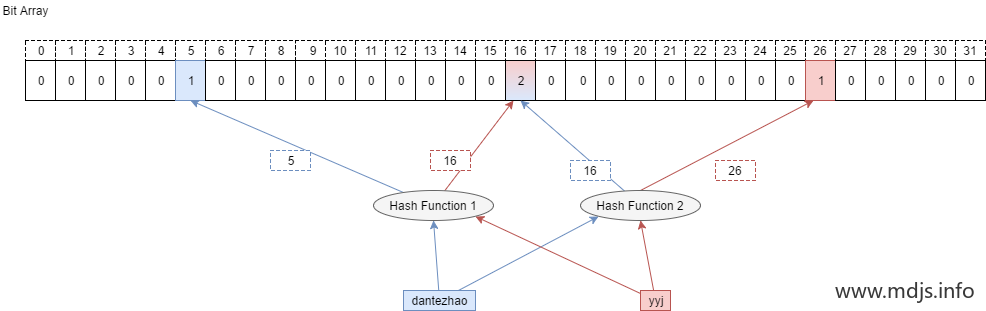
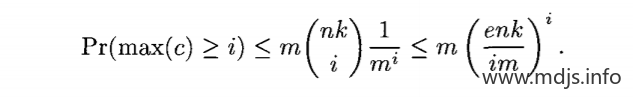
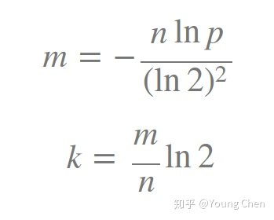

# Counting Bloom Fliter

由于标准 BF **不能实现删除** ，所以如果要表达的集合经常变动，引入 CBF 来实现此类功能。

### 与标准 BF 的区别

它将标准 Bloom Filter 位数组的每一位扩展为一个小的**计数器** （Counter），在插入元素时给对应的 k （k 为哈希函数个数）个 Counter 的值分别加 1，删除元素时给对应的 k 个 Counter 的值分别减 1。Counting Bloom Filter 通过**多占用几倍的存储空间** 的代价， 给 Bloom Filter 增加了删除操作。基本原理是不是很简单？看下图就能明白它和 Bloom Filter 的区别在哪。




### Counter 大小的选择

CBF 和 BF 的一个主要的不同就是 CBF 用一个 Counter 取代了 BF 中的一位，那么 Counter 到底取多大比较合适呢？这里就要考虑到空间利用率的问题了，从使用的角度来看，当然是越大越好，因为 Counter 越大就能表示越多的信息。但是越大的 Counter 就意味着更多的资源占用，而且在很多时候会造成极大的空间浪费。

因此，我们在选择 Counter 的时候，可以看 Counter 取值的范围多小就可以满足需求。

根据论文中描述，某一个 Counter 的值大于或等于 i 的概率可以通过如下公式描述，其中 n 为集合的大小，m 为 Counter 的数量，k 为 哈希函数的个数。



k 的最佳取值为 `k = m/n * ln2`



将其带入公式后可得。


如果每个 Counter 分配 4 位，那么当 Counter 的值达到 16 时就会溢出。这个概率如下，这个值足够小，因此对于大多数应用程序来说，4位就足够了。


关于 CBF 中 Counter 大小的选择，主要参考这篇论文：《Summary Cache: A Scalable Wide-Area Web Cache Sharing Protocol》，在论文的第 6、7 两页专门对其做了一番阐述。这里不再推导细节，只给出一个大概的说明，感兴趣的童鞋可以参考原论文。

### 简单 python 实现

```python
import mmh3

class CountingBloomFilter:
    def __init__(self, size, hash_num):
        self.size = size
        self.hash_num = hash_num
        self.byte_array = bytearray(size)
    def add(self, s):
        for seed in range(self.hash_num):
            result = mmh3.hash(s, seed) % self.size
            if self.bit_array[result] < 256:
                self.bit_array[result] += 1
    def lookup(self, s):
        for seed in range(self.hash_num):
            result = mmh3.hash(s, seed) % self.size
            if self.bit_array[result] == 0:
                return "Nope"
        return "Probably"
    def remove(self, s):
        for seed in range(self.hash_num):
            result = mmh3.hash(s, seed) % self.size
            if self.bit_array[result] > 0:
                self.bit_array[result] -= 1

cbf = CountingBloomFilter(500000, 7)
cbf.add("dantezhao")
cbf.add("yyj")
cbf.remove("dantezhao")
print (cbf.lookup("dantezhao"))
print (cbf.lookup("yyj"))
```


### 总结

CBF 虽说解决了 BF 的不能删除元素的问题，但是自身仍有不少的缺陷有待完善，比如 Counter 的引入就会带来很大的资源浪费，CBF 的 FP 还有很大可以降低的空间， 因此在实际的使用场景中会有很多 CBF 的升级版。

