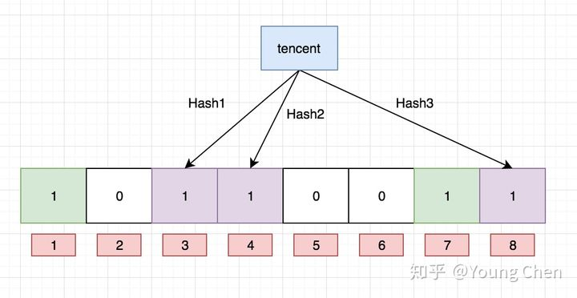

# 布隆过滤器

设计巧妙的概率型数据结构 (  probabilistic data structure )，特点是**高效地插入和查询** ，它可以告诉你“某样东西一定不存在或者可能存在”。

### 算法：  

1. 首先需要k个hash函数，每个函数可以把key散列成为1个整数  

2. 初始化时，需要一个长度为n比特的数组，每个比特位初始化为0  

3. 某个key加入集合时，用k个hash函数计算出k个散列值，并把数组中对应的比特位置为1  

4. 判断某个key是否在集合时，用k个hash函数计算出k个散列值，并查询数组中对应的比特位，如果所有的比特位都是1，认为在集合中。

### 图解

布隆过滤器是一个 bit 向量或者说 bit 数组

如果我们要映射一个值到布隆过滤器中，我们需要使用**多个不同的哈希函数** 生成**多个哈希值** ，并对每个生成的哈希值指向的 bit 位置 1，例如针对值 “baidu” 和三个不同的哈希函数分别生成了哈希值 1、4、7，则上图转变为：

Ok，我们现在再存一个值 “tencent”，如果哈希函数返回 3、4、8 的话，图继续变为：

值得注意的是，4 这个 bit 位由于两个值的哈希函数都返回了这个 bit 位，因此它被覆盖了。

现在我们如果想查询 “dianping” 这个值是否存在，哈希函数返回了 1、5、8三个值，结果我们发现 5 这个 bit 位上的值为 0，**说明没有任何一个值映射到这个 bit 位上** ，因此我们可以很确定地说 “dianping” 这个值不存在。

而当我们需要查询 “baidu” 这个值是否存在的话，那么哈希函数必然会返回 1、4、7，然后我们检查发现这三个 bit 位上的值均为 1，那么我们可以说 “baidu” **存在了么？答案是不可以，只能是 “baidu” 这个值可能存在。** 

### 优点：高效，不需要存储key，节省空间

### 缺点：  

1. 返回结果是概率型的，不是确切的

2. 无法删除 ( 使用一种变种 Counting Bloom Filter 可实现删除功能 )

### 哈希函数个数以及布隆过滤器长度选择

很显然，过小的布隆过滤器很快所有的 bit 位均为 1，那么查询任何值都会返回“可能存在”，起不到过滤的目的了。布隆过滤器的长度会直接影响误报率，布隆过滤器越长其误报率越小。

另外，哈希函数的个数也需要权衡，个数越多则布隆过滤器 bit 位置位 1 的速度越快，且布隆过滤器的效率越低；但是如果太少的话，那我们的误报率会变高。

k 为哈希函数个数，m 为布隆过滤器长度，n 为插入的元素个数，p 为误报率

如何选择适合业务的 k 和 m 值呢，这里直接贴一个公式：

### 参考资料

[详解布隆过滤器的原理，使用场景和注意事项 - 知乎 (zhihu.com)](https://zhuanlan.zhihu.com/p/43263751)

[布隆过滤器(Bloom Filter)详解 - 李玉龙 - 博客园 (cnblogs.com)](https://www.cnblogs.com/liyulong1982/p/6013002.html)

[Counting Bloom Fliter](CountingBloomFliter/CountingBloomFliter.md)

