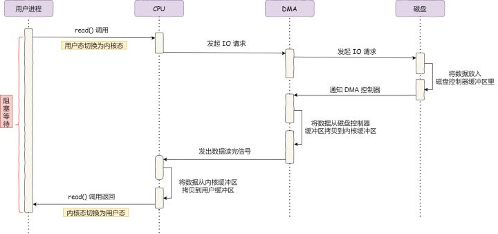
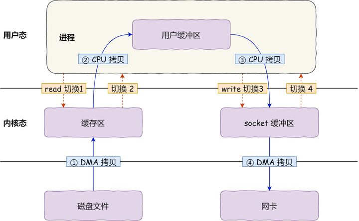
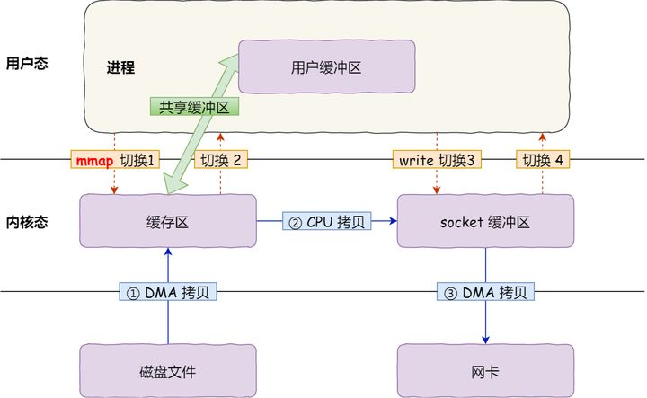
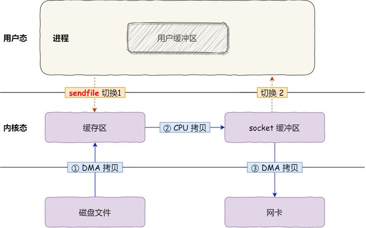
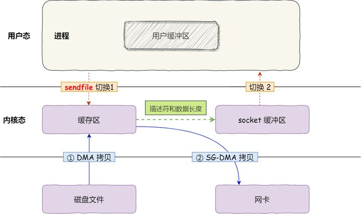

# 零拷贝

## IO 控制

### CPU 亲自控制

&ensp;&ensp;&ensp;&ensp;*  CPU 发出对应的指令给磁盘控制器，然后返回；
&ensp;&ensp;&ensp;&ensp;*  磁盘控制器收到指令后，于是就开始准备数据，会把数据放入到磁盘控制器的内部缓冲区中，然后产生一个**中断** ；
&ensp;&ensp;&ensp;&ensp;*  CPU 收到中断信号后，停下手头的工作，接着把磁盘控制器的缓冲区的数据一次一个字节地读进自己的寄存器，然后再把寄存器里的数据写入到内存，而在数据传输的期间 CPU 是无法执行其他任务的。

&ensp;&ensp;&ensp;&ensp;


在整个数据传输过程中，CPU 参与了数据搬运的多个过程，在此期间，CPU不能做其他事，大大降低了 CPU的利用率。

### DMA 技术

在进行 I/O 设备和内存的数据传输的时候，数据搬运的工作全部交给 DMA 控制器，而 CPU 不再参与任何与数据搬运相关的事情，这样 CPU 就可以去处理别的事务。

流程为：

&ensp;&ensp;&ensp;&ensp;*  用户进程调用 read 方法，向操作系统发出 I/O 请求，请求读取数据到自己的内存缓冲区中，进程进入阻塞状态；
&ensp;&ensp;&ensp;&ensp;*  操作系统收到请求后，进一步将 I/O 请求发送 DMA，然后让 CPU 执行其他任务；
&ensp;&ensp;&ensp;&ensp;*  DMA 进一步将 I/O 请求发送给磁盘；
&ensp;&ensp;&ensp;&ensp;*  磁盘收到 DMA 的 I/O 请求，把数据从磁盘读取到磁盘控制器的缓冲区中，当磁盘控制器的缓冲区被读满后，向 DMA 发起中断信号，告知自己缓冲区已满；
&ensp;&ensp;&ensp;&ensp;*  **DMA 收到磁盘的信号，将磁盘控制器缓冲区中的数据拷贝到内核缓冲区中，此时不占用 CPU，CPU 可以执行其他任务** ；
&ensp;&ensp;&ensp;&ensp;*  当 DMA 读取了足够多的数据，就会发送中断信号给 CPU；
&ensp;&ensp;&ensp;&ensp;*  CPU 收到 DMA 的信号，知道数据已经准备好，于是将数据从内核拷贝到用户空间，系统调用返回；





数据准备不再需要 CPU 的工作，而是由DMA全权负责，CPU只需发起信号与接收信号，并把准备好的数据从内核拷贝到用户区。


## 传统文件传输

将磁盘上的文件读取出来，然后通过网络协议发送给客户端。这其中的数据读取和写入是从用户空间到内核空间来回复制，而内核空间的数据是通过操作系统层面的 I/O 接口从磁盘读取或写入。

一般会通过下面两个系统调用完成。

```c
read(file, tmp_buf, len);
write(socket, tmp_buf, len);
```





期间共**发生了 4 次用户态与内核态的上下文切换** ，因为发生了两次系统调用，一次是 `read()` ，一次是 `write()`，每次系统调用都得先从用户态切换到内核态，等内核完成任务后，再从内核态切换回用户态。
上下文切换到成本并不小，一次切换需要耗时几十纳秒到几微秒，虽然时间看上去很短，但是在高并发的场景下，这类时间容易被累积和放大，从而影响系统的性能。
其次，还**发生了 4 次数据拷贝** ，其中两次是 DMA 的拷贝，另外两次则是通过 CPU 拷贝的，下面说一下这个过程：
*   *第一次拷贝* ，把磁盘上的数据拷贝到操作系统内核的缓冲区里，这个拷贝的过程是通过 DMA 搬运的。
*   *第二次拷贝* ，把内核缓冲区的数据拷贝到用户的缓冲区里，于是我们应用程序就可以使用这部分数据了，这个拷贝到过程是由 CPU 完成的。
*   *第三次拷贝* ，把刚才拷贝到用户的缓冲区里的数据，再拷贝到内核的 socket 的缓冲区里，这个过程依然还是由 CPU 搬运的。
*   *第四次拷贝* ，把内核的 socket 缓冲区里的数据，拷贝到网卡的缓冲区里，这个过程又是由 DMA 搬运的。
我们回过头看这个文件传输的过程，我们只是搬运一份数据，结果却搬运了 4 次，过多的数据拷贝无疑会消耗 CPU 资源，大大降低了系统性能。
因为文件传输一般不需要再加工，这些冗余的上文切换和数据拷贝，在高并发系统里是非常糟糕的，多了很多不必要的开销，会严重影响系统性能。
所以，**要想提高文件传输的性能，就需要减少「用户态与内核态的上下文切换」和「内存拷贝」的次数** ，即**「零拷贝」** 技术**。** 


## 零拷贝

### mmap + write

`mmap()` 系统调用函数会直接把内核缓冲区里的数据「**映射** 」到用户空间，这样，操作系统内核与用户空间就不需要再进行任何的数据拷贝操作。

```c
buf = mmap(file, len);
write(sockfd, buf, len);
```





具体过程如下：
*   应用进程调用了 `mmap()` 后，DMA 会把磁盘的数据拷贝到内核的缓冲区里。接着，应用进程跟操作系统内核「共享」这个缓冲区；
*   应用进程再调用 `write()`，操作系统直接将内核缓冲区的数据拷贝到 socket 缓冲区中，这一切都发生在内核态，由 CPU 来搬运数据；
*   最后，把内核的 socket 缓冲区里的数据，拷贝到网卡的缓冲区里，这个过程是由 DMA 搬运的。

由上述可知，使用 mmap 替代 read 可以减少一次数据拷贝过程，但这还不是最理想的零拷贝，因为仍然需要通过 CPU 把内核缓冲区的数据拷贝到 socket 缓冲区里，而且仍然需要 4 次上下文切换，因为系统调用还是 2 次。

### sendfile

在 Linux 内核版本 2.1 中，提供了一个专门发送文件的系统调用函数 `sendfile()`，函数形式如下：

```c

#include <sys/socket.h>
ssize_t sendfile(int out_fd, int in_fd, off_t *offset, size_t count);

```


它的前两个参数分别是目的端和源端的文件描述符，后面两个参数是源端的偏移量和复制数据的长度，返回值是实际复制数据的长度。
首先，它可以替代前面的 read() 和 write() 这两个系统调用，这样就可以减少一次系统调用，也就减少了 2 次上下文切换的开销。
其次，该系统调用，可以直接把内核缓冲区里的数据拷贝到 socket 缓冲区里，不再拷贝到用户态，这样就只有 2 次上下文切换，和 3 次数据拷贝。如下图：





但是这还不是真正的零拷贝技术，如果网卡支持 SG-DMA（*The Scatter-Gather Direct Memory Access* ）技术（和普通的 DMA 有所不同），我们可以进一步减少通过 CPU 把内核缓冲区里的数据拷贝到 socket 缓冲区的过程。

你可以在你的 Linux 系统通过下面这个命令，查看网卡是否支持 scatter-gather 特性：


```Bash
$ ethtool -k eth0 | grep scatter-gather
scatter-gather: on
```


于是，从 Linux 内核 `2.4` 版本开始起，对于支持网卡支持 SG-DMA 技术的情况下， `sendfile()` 系统调用的过程发生了点变化，具体过程如下：
*   第一步，通过 DMA 将磁盘上的数据拷贝到内核缓冲区里；
*   第二步，缓冲区描述符和数据长度传到 socket 缓冲区，这样网卡的 SG-DMA 控制器就可以直接将内核缓存中的数据拷贝到网卡的缓冲区里，此过程不需要将数据从操作系统内核缓冲区拷贝到 socket 缓冲区中，这样就减少了一次数据拷贝；
所以，这个过程之中，只进行了 2 次数据拷贝，如下图：





这种技术可以实现真正的**零拷贝** 技术，在内存层面没有任何数据拷贝过程。

### splice

sendfile只适用于将数据从文件拷贝到套接字上，限定了它的使用范围。Linux在`2.6.17`版本引入`splice`系统调用，用于在两个文件描述符中移动数据：

```c
#define _GNU_SOURCE         /* See feature_test_macros(7) */
#include <fcntl.h>
ssize_t splice(int fd_in, loff_t *off_in, int fd_out, loff_t *off_out, size_t len, unsigned int flags);
```


splice调用利用了Linux提出的管道缓冲区机制， 所以至少一个描述符要为管道。


零拷贝技术的文件传输方式相比传统文件传输的方式，减少了 2 次上下文切换和数据拷贝次数，**只需要 2 次上下文切换和数据拷贝次数，就可以完成文件的传输，而且 2 次的数据拷贝过程，都不需要通过 CPU，2 次都是由 DMA 来搬运。** 所以，总体来看，**零拷贝技术可以把文件传输的性能提高至少一倍以上** 。

splice调用在两个文件描述符之间移动数据，而不需要数据在内核空间和用户空间来回拷贝。他从`fd_in`拷贝`len`长度的数据到`fd_out`，但是有一方必须是管道设备，这也是目前`splice`的一些局限性。`flags`参数有以下几种取值：
*   **SPLICE_F_MOVE**  ：尝试去移动数据而不是拷贝数据。这仅仅是对内核的一个小提示：如果内核不能从`pipe`移动数据或者`pipe`的缓存不是一个整页面，仍然需要拷贝数据。Linux最初的实现有些问题，所以从`2.6.21`开始这个选项不起作用，后面的Linux版本应该会实现。
*   **SPLICE_F_NONBLOCK** ：`splice` 操作不会被阻塞。然而，如果文件描述符没有被设置为不可被阻塞方式的 I/O ，那么调用 splice 有可能仍然被阻塞。
*   **SPLICE_F_MORE** ： 后面的`splice`调用会有更多的数据。

## 参考

[原来 8 张图，就可以搞懂「零拷贝」了 - 知乎 (zhihu.com)](https://zhuanlan.zhihu.com/p/258513662)

[https://blog.csdn.net/weixin_42096901/article/details/103017044](https://blog.csdn.net/weixin_42096901/article/details/103017044)


